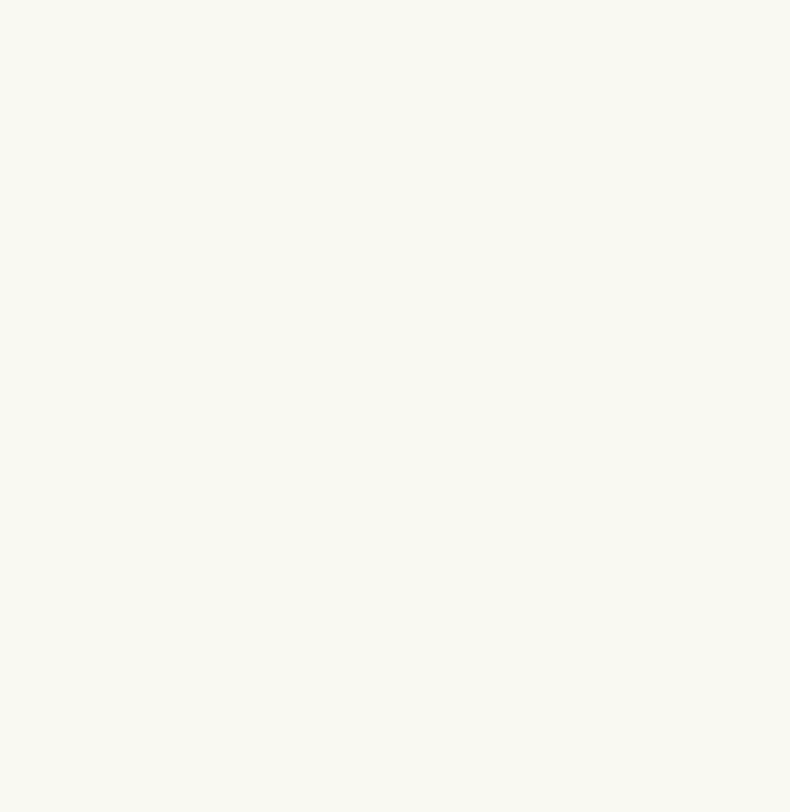

# Superseed Brand Kit

Welcome to the Superseed brand kit! Here, you'll find all the necessary information to effectively utilize our brand assets and understand our branding guidelines. Please review this document thoroughly before incorporating our brand elements into your work.

## Brand Pillars

- **Purpose:** Rewarding those who live onchain
- **Mission:** Empowering builders and users of today
- **Vision:** Sowing the seed of a decentralized tomorrow

## Values

- Expanding Ethereum
- Contributing to the ecosystem is not just encouraged—it’s rewarded.

## Brand Identity Guidelines

Before you begin any design work, it's crucial to familiarize yourself with our brand identity guidelines. You can access the detailed guidelines by clicking the link below:

[Superseed Brand Identity Guideline.pdf](https://github.com/superseed-xyz/brand-kit/blob/main/guide/Superseed%20Brand%20Identity%20Guideline.pdf)

## Logos & Wordmarks

Find our logos and wordmarks in the following link:

[Logos & Wordmarks](https://github.com/superseed-xyz/brand-kit/tree/main/logos-wordmarks)

## Colours

Explore our color palette:

| Color Name     | Hex Code  | Sample                                                                 |
|----------------|-----------|-------------------------------------------------------------------------|
| Superseed Light Green  | `#93D0CF` |  |
| Tangaroa       | `#0E273B` |              |
| Aluminium      | `#808386` |            |
| White          | `#F9F9F2` |                    |
| Black          | `#060606` |                    |

## Typography

### Headline
- Font: Open Sans Bold
- [Download Open Sans Bold](https://fonts.google.com/specimen/Open+Sans)

### Body
- Font: Open Sans Regular
- [Download Open Sans Regular](https://fonts.google.com/specimen/Open+Sans)

### CTAs & Accents
- Font: Open Sans Bold
- [Download Open Sans Bold](https://fonts.google.com/specimen/Open+Sans)

## Support

If you have any questions regarding the usage of our assets or if you feel that something is missing, don't hesitate to open an issue or reach out to us in our community. We're here to help!

Thank you for being a part of the Superseed community! 🌱
