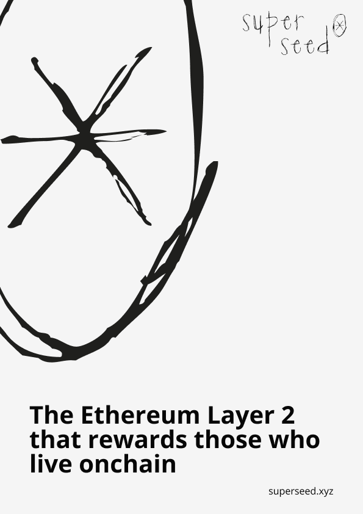
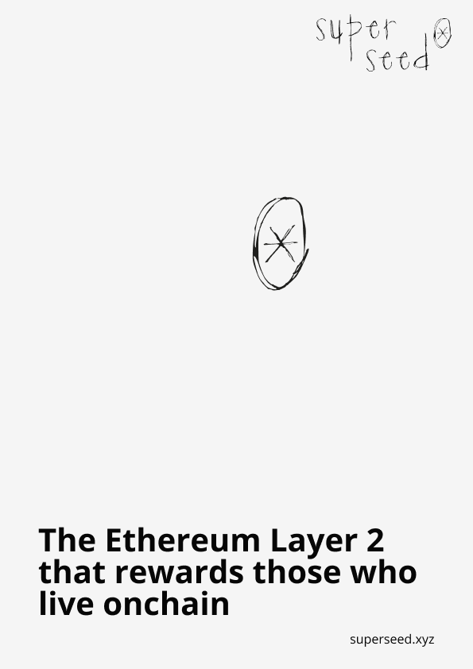
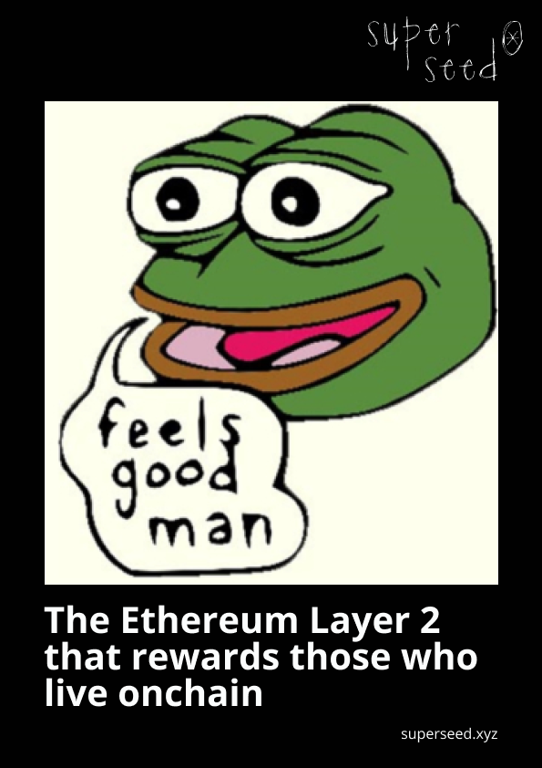
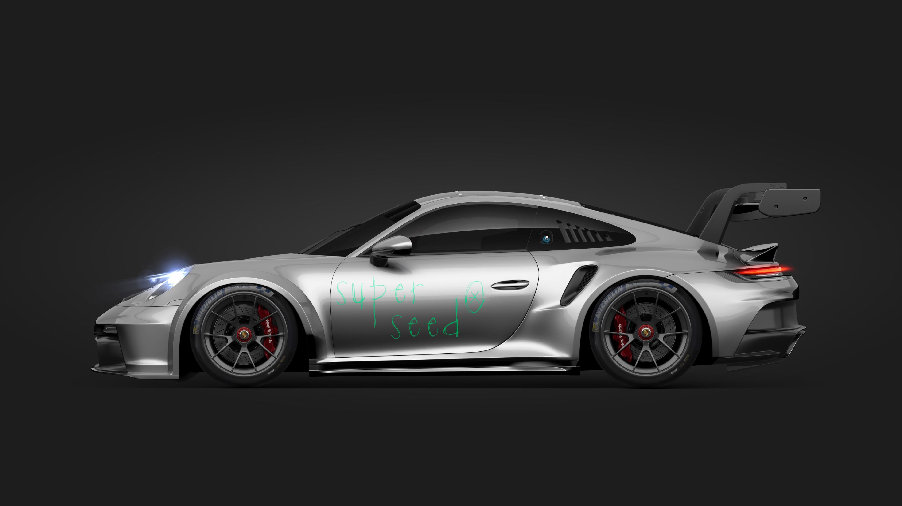
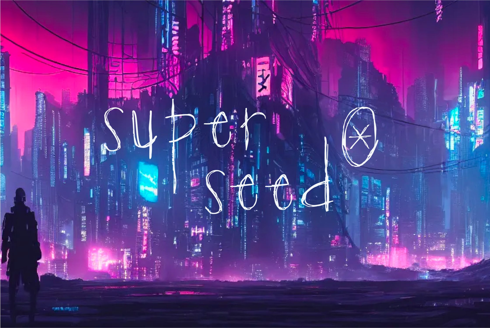
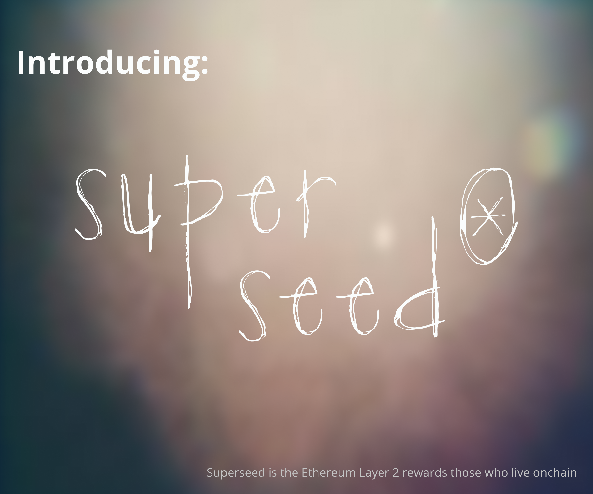

# Logos & Wordmarks

Superseed’s logo is not a logo, but a **claim.** 
It belongs to each of us in the community. The logo is the face of the Superseed, meaning that we need to be careful to use it correctly and consistently.

Superseed’s wordmark is outlined. Think of it like a graffiti or a tag on the wall, anyone can draw it anywhere. It can be applied on top and next to pretty much anything (flat colour or picture), as long as it’s remains readable and recognisable. You can make it so big it goes beyond the support’s margin or very small. 

It can be drawn in whichever colour, but **ALWAYS** a stroke of the same colour, no gradient, no 2 colour.

Because the logo is a script outline, it has been adapted to be used in different sizes. Depending on the media and situation pick the right one to ensure recognisability and readability. The smaller sizes have fatter strokes than the larger ones (like it would be if drawn with a pencil). The larger the display of the logo, the thinner the outline.

We'd like to keep our logos simple and consistent. So no spinning, no shadows, no extra effects, and no mixing them up with other logos or icons. Keep things simple and clean.

Please note that the wordmark and logomark can be used interchangeably, but avoid using them together.

### Wordmarks

| As a size                        | PNG                                                            | SVG                                                            | SVG (For Light Background)                                                    |
|----------------------------------|----------------------------------------------------------------|----------------------------------------------------------------|---------------------------------------------------------------|
| [Small](./wordmarks/small.png)   |     |     |     |
| [Default](./wordmarks/default.png)|  |  |  |
| [Large](./wordmarks/large.png)   |     |     |     |

### Logos

| As a size                         | PNG                                                            | SVG                                                            | SVG (For Light Background)                                                   |
|-----------------------------------|----------------------------------------------------------------|----------------------------------------------------------------|---------------------------------------------------------------|
| [Small](./logos/small.png)        |     |     |     |
| [Default](./logos/default.png)    |  |  |  |
| [Large](./logos/large.png)        |     |     |     |

## Extra Wordmarks

In some exceptional cases it might be necessary to have a slightly different wordmark. This is why there are 2 extra wordmark designs: 

- with an added background for situations when the readability is too low due to the background, or when placed next to other logos
- a horizontal wordmark, in cases the vertical is really limited

ONLY USE THESE IF THE ONES ABOVE ABSOLUTELY DO NOT WORK.

| As a size | PNG | SVG | SVG (For Light Background) |
|-----------|-----|-----|----------------------------|
| [With Black Background](./extra-wordmarks/black-bg.png) |  |  |  |
| [With White Background](./extra-wordmarks/white-bg.png) |  |  |  |
| [Small](./extra-wordmarks/small.png) |  |  |  |
| [Default](./extra-wordmarks/default.png) |  |  |  |
| [Large](./extra-wordmarks/large.png) |  |  |  |

## Brand in use

  
  
  
  
  

  
  
  

